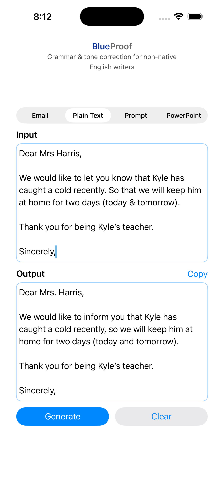

//
//  README.md
//  BlueProof
//
//  Created by Kien Trinh on 1/12/26.
//

# BlueProof 📘

BlueProof is a personal iOS app that uses OpenAI LLMs to correct grammar and tone for non-native English writers.

---

## Features
- Grammar & tone correction
- Modes: Email, Plain Text, Prompt, PowerPoint
- Blue-themed UI
- Secure API key storage (Keychain)
- Runs on real iPhone and Simulator

---

## Requirements
- macOS with Xcode installed
- Apple ID signed into Xcode
- iPhone (optional, for real-device testing)
- Internet connection

---

## Build & Run on iPhone Simulator

1. Open `BlueProof.xcodeproj` in Xcode
2. In the top toolbar, select an iPhone Simulator (e.g. iPhone 15)
3. Click **Run ▶**
4. The app launches in the Simulator

---

## Build & Run on Real iPhone Device

1. Connect iPhone to Mac with cable
2. Unlock iPhone and tap **Trust This Computer** if prompted
3. In Xcode:
   - Select your iPhone as the run destination
   - Go to **Signing & Capabilities**
   - Enable **Automatically manage signing**
   - Select your Apple ID as Team
4. Click **Run ▶**
5. On iPhone:
   - Settings → Privacy & Security → Developer Mode → ON
   - Trust your Apple ID under Device Management (first time only)

⚠️ Note: Apps built with a free Apple ID expire after 7 days.
Rebuild from Xcode to refresh.

---

## API Key Setup (Secure)

- The OpenAI API key is stored in **iOS Keychain**
- On first launch, the app prompts for the API key
- The key is encrypted and persists across app launches
- To reset the key, delete the app or use the reset option in the UI (if added)

---

## Keyboard & UX Notes

- Swipe down to dismiss keyboard
- ScrollView allows access to buttons when keyboard is visible
- "Done" button appears above keyboard

---

## App Icon
- Icon is set via `Assets.xcassets → AppIcon`
- Source image: 1024 × 1024 PNG, no transparency

---

## Model & API
- OpenAI model: `gpt-4.1-mini`
- API endpoint: `POST https://api.openai.com/v1/responses`

---

## Troubleshooting

### App won’t open after a few days
- Rebuild and reinstall from Xcode (free Apple ID limitation)

### API authentication error
- Ensure API key is saved correctly in Keychain
- Check internet connection

### Keyboard hides buttons
- Scroll down or swipe down to dismiss keyboard

---

## Notes for Future Me 🙂
- This is a personal app, not App Store–published
- API key should never be hardcoded
- If distributing publicly, use a backend proxy

